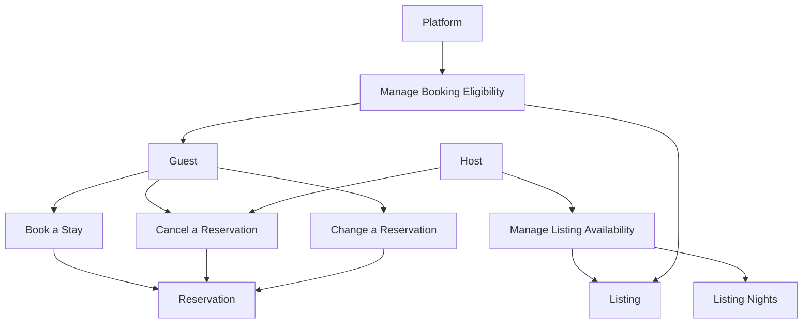

# Stay Booking Example App

This example app is a booking system for stays. It is not a full clone of Airbnb or Booking.com, but it uses the same basic language: guests book stays, hosts offer listings, and the system confirms reservations.

The purpose of the app is to describe the core flow behind a stay booking without turning the example into a full travel platform. We focus on the business behavior that matters when a guest wants to reserve a listing for a date range.

A guest does not think in database rows or technical operations. A guest wants to book a stay. The system has to decide whether the stay can be confirmed. If the guest is allowed to book, the listing is available, the requested dates are free, and the booking rules are satisfied, the system confirms a reservation.

## Ubiquitous language

The domain uses a few central terms.

A **guest** is the person who wants to book a stay.

A **host** offers one or more **listings**.

A **listing** is the place that can be booked, for example an apartment, room, or house.

A **stay** describes the guest’s intended visit: listing, check-in date, check-out date, and number of guests.

A **reservation** is the confirmed result of a successful booking.

A **night** is the unit of availability. A stay from July 1 to July 4 uses the nights of July 1, July 2, and July 3. The check-out day is not occupied.

A listing can be **bookable** or **disabled**. A guest can be **eligible to book** or **blocked from booking**.

## Capability 1: Book a Stay

This is the main capability for the first version.

A guest chooses a listing, a check-in date, a check-out date, and a guest count. The system checks whether the guest may book, whether the listing can be booked, whether the stay matches the listing’s rules, and whether the requested nights are still available.

If everything is valid, the reservation is confirmed.

If not, the booking is rejected with a clear reason, such as:

```text
guest is blocked
listing is disabled
too many guests
stay is too short
stay is too long
listing is unavailable for the requested dates
```

The important business idea is simple: booking a stay is not just placing a reservation somewhere. It is a decision that depends on the current booking situation.

## Capability 2: Cancel a Reservation

A guest or host may cancel an existing reservation, depending on the rules of the platform.

When a reservation is cancelled, the affected nights are no longer occupied by that reservation. This does not automatically mean they are available for every future booking, because the host may have blocked them separately. But the cancelled reservation itself no longer prevents another stay from being booked.

This capability belongs to the same domain area as booking because it changes the booking situation for the listing.

## Capability 3: Change a Reservation

A guest may request a change to an existing reservation, for example different dates or a different guest count.

The system has to evaluate the changed stay as a new booking situation. The new dates must be available, the listing rules must still be satisfied, and the guest must still be allowed to book. If the change is accepted, the reservation is adjusted. If not, the existing reservation remains unchanged.

This capability is intentionally separate from booking a new stay. It has related rules, but the business meaning is different.

## Capability 4: Manage Listing Availability

A host can block or release nights for a listing.

Blocked nights cannot be booked by guests. This may happen because the host uses the listing privately, plans maintenance, or simply does not want to accept bookings for that period.

This capability affects the same availability that booking depends on, but the intent is different. The host is not booking a stay. The host is controlling when the listing can receive reservations.

## Capability 5: Manage Booking Eligibility

The platform may block or restore a guest’s ability to book. It may also disable or restore a listing’s ability to receive bookings.

This capability is not about a specific reservation. It changes whether future reservations are allowed. A blocked guest cannot confirm new reservations. A disabled listing cannot receive new bookings, even if the requested nights are free.

This gives the app a simple but realistic rule: availability alone is not enough. A reservation can only be confirmed when the guest, the listing, and the requested nights are all valid for booking.

## Capability map



## First version scope

The first version should focus on **Book a Stay**.

Listing booking rules such as guest capacity, minimum nights, and maximum nights are treated as existing listing settings in the first version. Managing these settings is outside the first implementation scope and can become a separate capability later.

That gives us enough domain behavior to make the example useful:

```text
guest eligibility
listing booking status
guest count limits
minimum and maximum nights
date range validation
existing reservations
listing availability per night
reservation confirmation
booking rejection
```

The other capabilities are important because they show how the app can grow. They also show why the booking capability must be precise about what it depends on. A change to a listing description should not affect a booking decision. A blocked night should. A changed guest display name should not affect a booking decision. A blocked guest should.

This is the business foundation for the technical example. The next document can then show how this domain is implemented with Command Context Consistency, Functional Core and Imperative Shell, Request Processing Units, and relational Application State.
